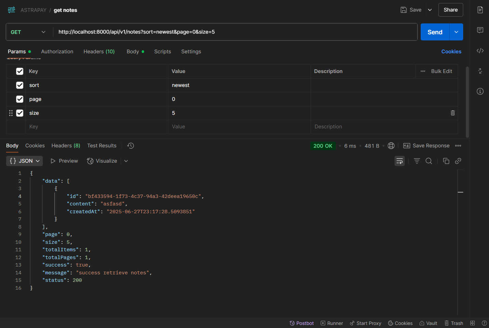
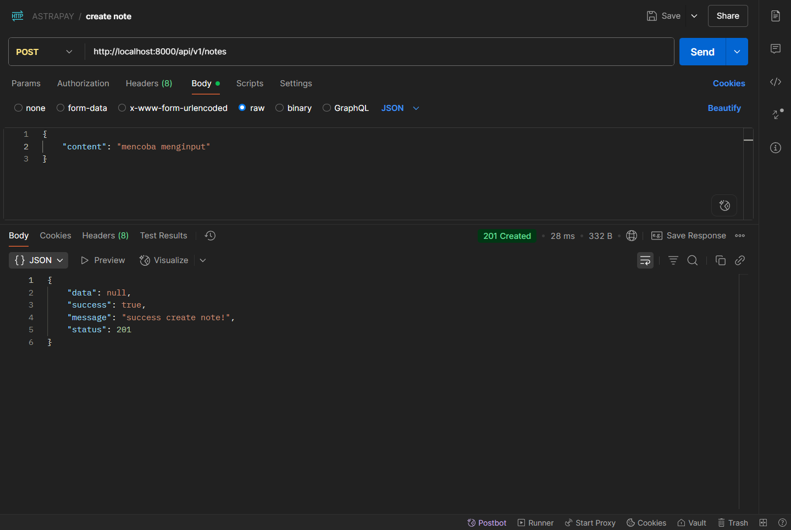
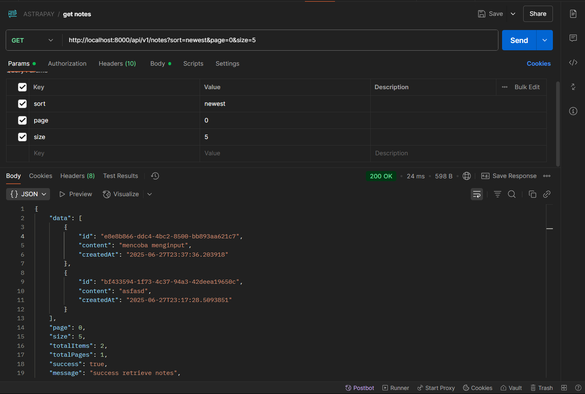
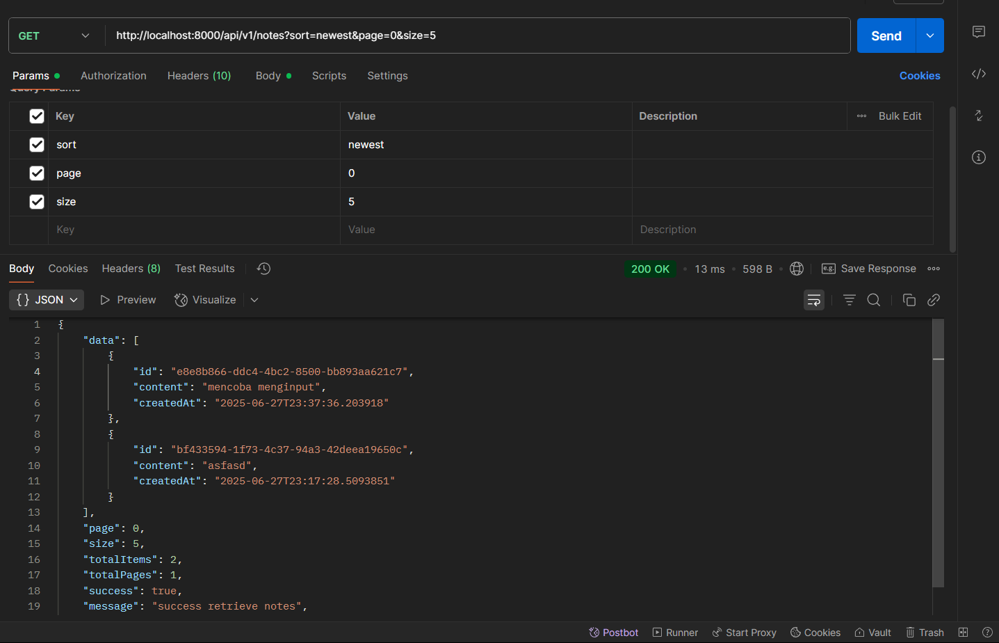
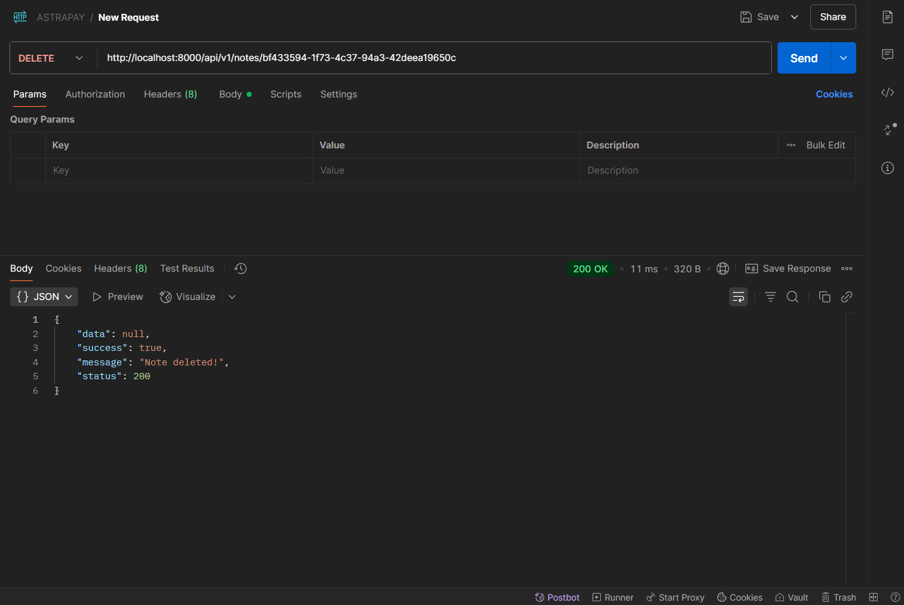
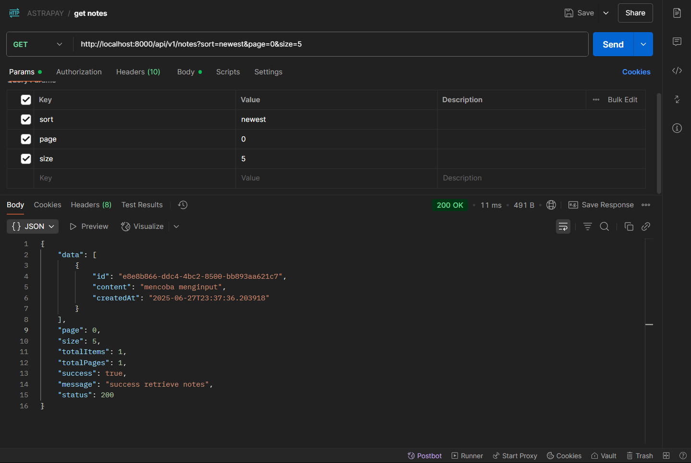
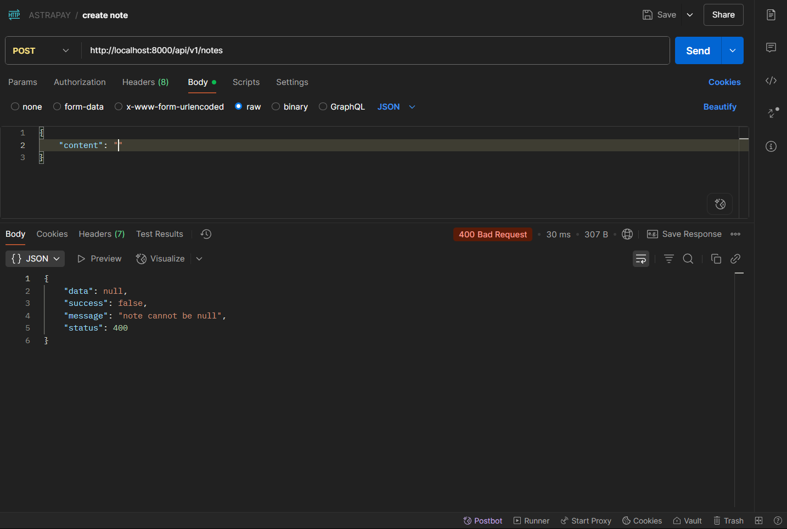
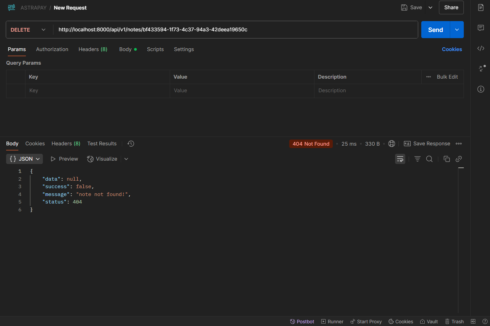
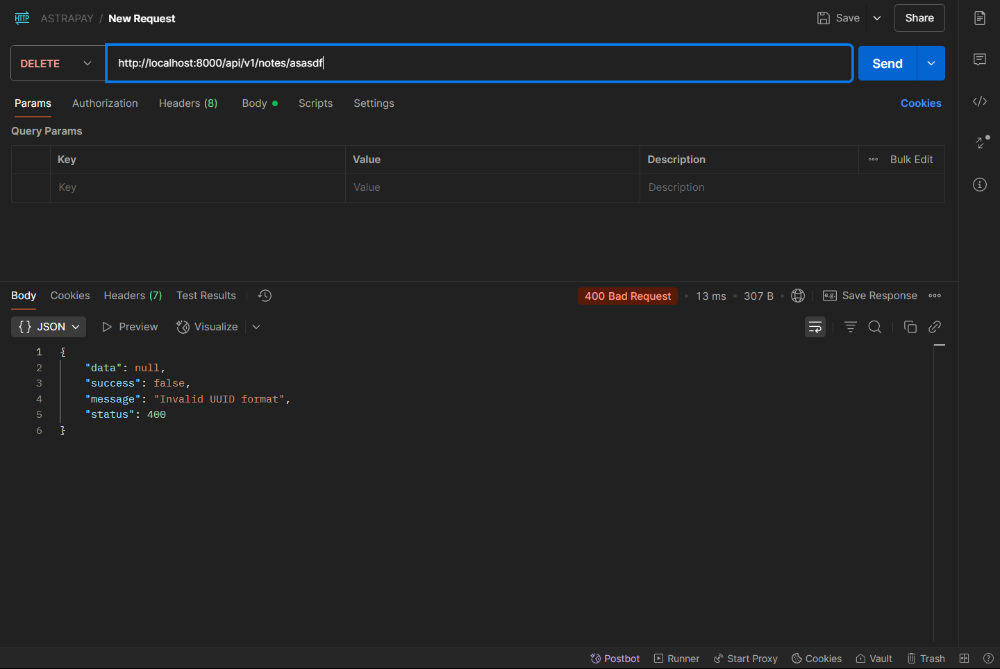

## How To

Untuk melihat tampilannya, Anda dapat pull repo berikut:

```bash
git clone https://github.com/fundayluck/angular_simple_note.git
```


sesuaikan dengan ini _app.cors.allowed-origins=http://localhost:3000_ dengan port frontendnya ya, itu berada di `application.properties`


ini adalah hasil apinya:

1.  Create (positive)

    - before input
    
    - do input
    
    - after input
    

2.  Read (positive)
    
    
3.  Delete (positive)

    - before detete
    
    - do delete
    
    - after delete
    
    
    
4.  Create (negative)
    
    
5.  delete (negative)
    
    - if id not found
    
    
    - if format id not valid
    
    


